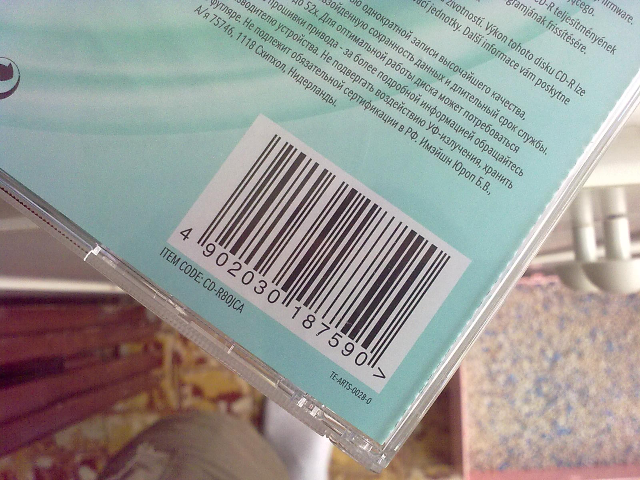
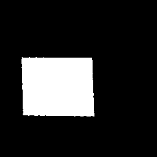
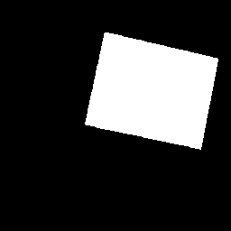
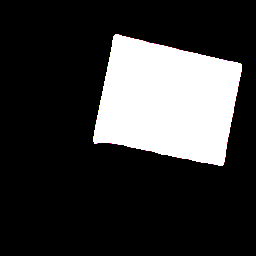
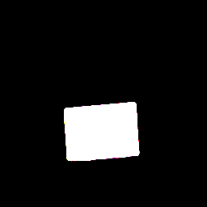

# Barcode segmentation
This repository contains the instructions to train and test a U-Net
built to extract the zone from an image where a barcode is found.<br>
## Requirements
Python 3.7 or later with all requirements, to install use the following commands incluiding tensorflow:
 ```
$ git clone https://github.com/mikecaav/barcode_segmentor.git
$ cd barcode_segmentor
$ pip install -U -r requirements.txt
 ```
## Dataset
We used the <a href=http://artelab.dista.uninsubria.it/downloads/datasets/barcode/hough_barcode_1d/1d_barcode_extended_plain.zip>
barcode_extended_plain</a> dataset to train our model, it consists on a set of jpeg images containing barcodes as the predictor 
variable and masks as the response corresponding to were the barcodes are allocated<br>
To download the dataset use the following command
```
# To download the dataset
$ wget http://artelab.dista.uninsubria.it/downloads/datasets/barcode/hough_barcode_1d/1d_barcode_extended_plain.zip
# To unzip the files
$ unzip 1d_barcode_extended_plain.zip
```
Finally, to split in training, test and validation datasets, we can use the following command
```
$ python3 split_datasets.py  
```
This command will split by default 30% for test and the remaining 70% will be split 30% for validation 
and the rest for training. 
### Predictor
<br>
### Response
<br>

## Training
To train the model we need to run the following command
```
$ python train.py
```
it will automatically look for the training dataset in ./dataset/train/ path and ./dataset/validation/ path for 
validation dataset (paths created with the split_dataset command) and start the training process, once its done,
you'll have a hdf5 file.

### Pretrained model
If instead of training your own model you want to use our pre-trained model, you can download the weights with the 
following command
```
$ wget https://srv-file10.gofile.io/download/7FcqdD/unet_200_steps.hdf5
```

## Testing the model
To test the model we use the following command
```
$ python test.py
```
The IoU from the resulted model its 80.13 from the test dataset and here are some of the results of our model
### True
<br>
### Predicted
<br>
### True
<br>
### Predicted
<br>
### True
<br>
### Predicted
<br>